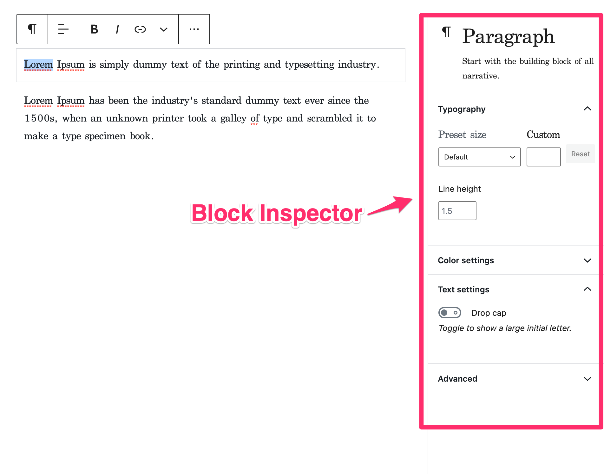

# Getting Started

Even essential Gutenberg block editor needs many JS packages and CSS styles to get started.
Our first Gutenberg application will look like:

```js
const App: React.FC = () => {
    const [ blocks, updateBlocks ] = useState( [] );

    useEffect( () => {
        registerCoreBlocks();
    }, [] );

    return (
        <SlotFillProvider>
            <BlockEditorProvider
                value={ blocks }
                onInput={ updateBlocks }
                onChange={ updateBlocks }
            >
                <div className="editor-sidebar">
                    <BlockInspector />
                </div>
                <div className="editor-styles-wrapper">
                    <Popover.Slot name="block-toolbar" />
                    <WritingFlow>
                        <ObserveTyping>
                            <BlockList />
                        </ObserveTyping>
                    </WritingFlow>
                </div>
            </BlockEditorProvider>
        </SlotFillProvider>
    )
};
```

In the application, you see a few components such as `SlotFillProvider`, `BlockEditorProvider`, `BlockInspector`, `Popover`, `WritingFlow`, `ObserveTyping`, and `BlockList`. Here I'm writing what I understand about the components.

## SlotFillProvider

The name of this component doesn't sound clear to me though the official document says it is inspired by a library called [react-slot-fill](https://github.com/camwest/react-slot-fill). From my understanding, Slot is a placeholder for toolbars or inspectors and Fill renders the content displayed in the slot. [The document](https://developer.wordpress.org/block-editor/components/slot-fill/) describes the components as follows:

> Slot and Fill are a pair of components which enable developers to render elsewhere in a React element tree, a pattern often referred to as “portal” rendering. It is a pattern for component extensibility, where a single Slot may be occupied by an indeterminate number of Fills elsewhere in the application.

If you're familiar with [React Context API](https://reactjs.org/docs/context.html), you may notice what _SlotFillProvider_ does - it provides a shared Context for slots and fills with [React Hooks](https://reactjs.org/docs/hooks-intro.html). Just like React's `Context.Provdier`, it is common to wrap the application with this provider.

The toolbars and inspectors won't appear without this component.

We're going to check the details of Slot and Fill in the following examples. Let's move on the next component for now.

## BlockEditorProvider

This component actually renders `RegistryProvider`, that provides a global store of editor state, with a few enhancements. It is simple yet important for understanding how the editor works. I'd recommend you to read [the short document](https://github.com/WordPress/gutenberg/tree/e01fb661f7118d94b57d29ac7cb01f0188e5ecf5/packages/block-editor/src/components/provider) thoroughly.

# BlockInspector

It renders the inspector for the selected component. It also cotain slots so components can add their own inspector controls to the area.



# Popover

It's a component renders popovers. You may notice the application code only uses a popup slot that will be filled with block toolbars.

# WritingFlow

`<WritingFlow />` is a component helps users have seamless editing experience by moving focus, modifying selection, or showing/hiding components in respond to observed keyboard/mouse events.

# BlockList

This is the core of the editor. It renders the content blocks.

# ObserveTyping

It manages the editor's internal typing flag. I will handle this component later.
